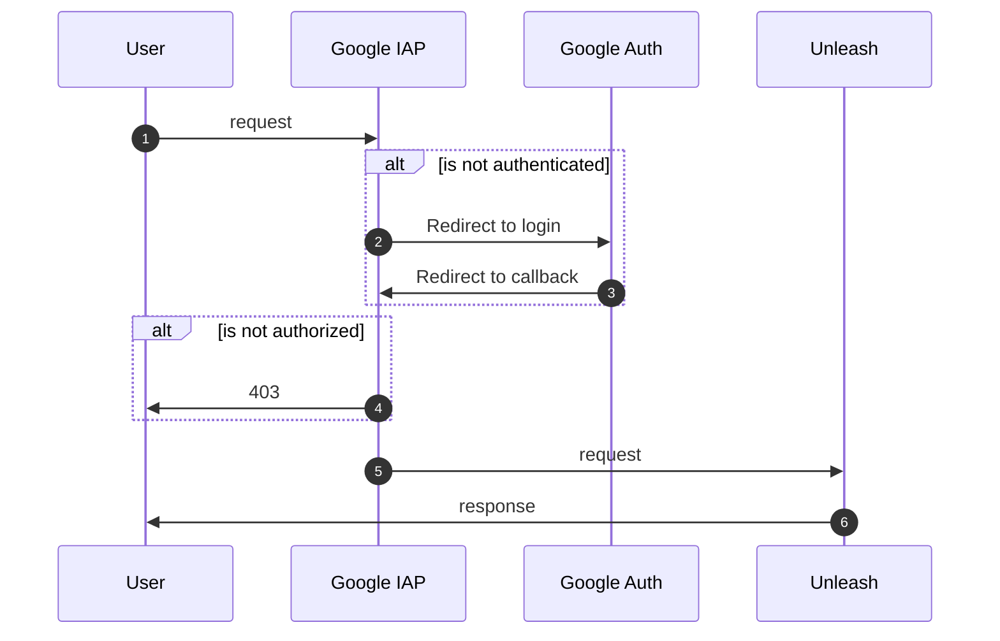

# NAIS Unleash


Customized [Unleash][unleash] feature flag server with [Google IAP authentication][google-iap] and OAuth JWT support. Built to work well with [Unleasherator][unleasherator], our Kubernetes operator for managing Unleash instances.

This repository is structured as a **pnpm monorepo** supporting multiple major versions of Unleash (currently v5 and v6, with v7 support planned).

[unleash]: https://github.com/Unleash/unleash
[unleasherator]: https://github.com/nais/unleasherator
[google-iap]: https://cloud.google.com/iap/docs/



## Configuration

### Google IAP Authentication

| environment variable        | description                                          | default                        |
| --------------------------- | ---------------------------------------------------- | ------------------------------ |
| `GOOGLE_IAP_JWT_HEADER`     | Header name for JWT token from Google IAP            | `x-goog-iap-jwt-assertion`     |
| `GOOGLE_IAP_JWT_ISSUER`     | Issuer for JWT token from Google IAP                 | `https://cloud.google.com/iap` |
| `GOOGLE_IAP_JWT_AUDIENCE`   | Audience for JWT token from Google IAP               | **REQUIRED**                   |
| `IAP_PUBLIC_KEY_CACHE_TIME` | Cache time for JWT token public keys from Google IAP | `3600`                         |

`GOOGLE_IAP_JWT_AUDIENCE` should be a string in the following format:

```text
/projects/PROJECT_NUMBER/global/backendServices/SERVICE_ID
```

### OAUTH JWT Authentication

| environment variable | description                         | default                              |
| -------------------- | ----------------------------------- | ------------------------------------ |
| `OAUTH_JWT_AUTH`     | Enable generic Oauth JWT validation | `false`                              |
| `OAUTH_JWT_HEADER`   | Header name for JWT token           | `X-Wonderwall-Forward-Auth-Token`    |
| `OAUTH_JWT_ISSUER`   | Issuer for JWT token                | `https://auth.nais.io`               |
| `OAUTH_JWT_AUDIENCE` | Audience for JWT token              | **REQUIRED**                         |
| `OAUTH_JWT_KEYSET`   | Keyset URL to fetch keyset from     | `https://auth.nais.io/oauth/v2/keys` |

### Authorization

| environment variable               | description                          | default      |
| ---------------------------------- | ------------------------------------ | ------------ |
| `TEAMS_API_URL`                    | URL for Teams API                    | **REQUIRED** |
| `TEAMS_API_TOKEN`                  | Token for Teams API                  | **REQUIRED** |
| `TEAMS_ALLOWED_TEAMS`              | Teams allowed to access Unleash      | **REQUIRED** |
| `TEAMS_USER_VALIDATION_CACHE_TIME` | Cache time for Teams user validation | `3600`       |

### Unleash configuration

| environment variable    | description                           | default      |
| ----------------------- | ------------------------------------- | ------------ |
| `INIT_ADMIN_API_TOKENS` | Admin API tokens to create on startup | **REQUIRED** |
| `AUTH_ENABLE_API_TOKEN` | Enable API token authentication       | `true`       |
| `SERVER_PORT`           | Port to listen on                     | `4242`       |
| `DATABASE_USERNAME`     | Username for database connection      | `unleash`    |
| `DATABASE_PASSWORD`     | Password for database connection      | `unleash`    |
| `DATABASE_NAME`         | Database name                         | `unleash`    |
| `DATABASE_HOST`         | Database host                         | `localhost`  |
| `DATABASE_SSL`          | Use SSL for database connection       | `false`      |
| `DATABASE_PORT`         | Database port                         | `5432`       |

## Monorepo Structure

```
packages/
├── shared/          # Shared authentication and authorization modules
│   ├── src/
│   │   ├── google-iap.ts    # Google IAP JWT authentication
│   │   ├── oauth-fa.ts      # OAuth forward auth JWT authentication
│   │   ├── nais-teams.ts    # NAIS Teams API integration
│   │   ├── cache.ts         # Simple in-memory cache
│   │   └── utils.ts         # Utility functions
│   └── package.json
├── unleash-v5/      # Unleash v5 server implementation
│   ├── src/
│   │   ├── server.ts        # Server factory with custom auth
│   │   └── index.ts         # Application entry point
│   └── package.json
└── unleash-v6/      # Unleash v6 server implementation
    ├── src/
    │   ├── server.ts        # Server factory with custom auth
    │   └── index.ts         # Application entry point
    └── package.json
```

### Workspace Scripts

Using pnpm directly:
```bash
# Build all packages
pnpm -r build

# Test all packages
pnpm -r test

# Lint all packages
pnpm -r lint

# Build/test/lint specific package
pnpm --filter @nais/unleash-shared build
pnpm --filter unleash-v5 test
pnpm --filter unleash-v6 build
```

Using mise tasks (recommended):
```bash
# Install dependencies
mise run install

# Build all packages
mise run build

# Start database and run all tests
mise run test:all

# Test shared package only (no database needed)
mise run test:shared

# Test v5 package with database
mise run test:v5

# Test v6 package with database
mise run test:v6

# Start development environment
mise run dev

# Start unleash-v5 server
mise run start:v5

# Start unleash-v6 server
mise run start:v6

# Database management
mise run db:start    # Start PostgreSQL
mise run db:stop     # Stop PostgreSQL
mise run db:wait     # Wait for database to be ready

# Docker tasks
mise run docker:build  # Build Docker image
mise run docker:run    # Run with docker-compose

# Clean everything
mise run clean
```

## Setup for local development

### Prerequisites

- [Node.js][nodejs] 24 or later (automatically installed with mise)
- [pnpm][pnpm] (automatically installed with mise)
- [Docker][docker] (required for PostgreSQL database)
- [mise][mise] (recommended for managing tools and running tasks)

[nodejs]: https://nodejs.org/en/
[pnpm]: https://pnpm.io/
[mise]: https://mise.jdx.dev/
[docker]: https://www.docker.com/

### Quick Start

```bash
# Install mise (if not already installed)
curl https://mise.run | sh

# Clone and setup
git clone https://github.com/nais/unleash.git
cd unleash

# Start development environment
mise run dev

# In another terminal, start the server
mise run start:v5
```

### Common Tasks

| Command                | Description                    |
| ---------------------- | ------------------------------ |
| `mise run dev`         | Setup complete dev environment |
| `mise run build`       | Build all packages             |
| `mise run test:shared` | Test shared package (no DB)    |
| `mise run test:v5`     | Test v5 with database          |
| `mise run test:v6`     | Test v6 with database          |
| `mise run test:all`    | Test everything                |
| `mise run start:v5`    | Start Unleash v5 server        |
| `mise run start:v6`    | Start Unleash v6 server        |
| `mise run db:start`    | Start PostgreSQL               |
| `mise run db:stop`     | Stop PostgreSQL                |
| `mise tasks`           | List all available tasks       |

### Running Unleash

**Quick start with mise (recommended):**

```bash
# Start development environment (installs deps, builds, starts database)
mise run dev

# In another terminal, start the server
mise run start:v5
```

Unleash will be available at `http://localhost:4242`.

**Using docker-compose:**

```bash
# Start everything (database + unleash v5)
mise run docker:run
# or
docker-compose up --build
```

This will expose Unleash on `http://localhost:8080`.

**Manual setup:**

```bash
# 1. Start database
mise run db:start

# 2. Install and build
mise run build

# 3. Start Unleash (v5 or v6)
cd packages/unleash-v5  # or unleash-v6
pnpm start
```

Running Unleash locally requires a database. The easiest way to manage it is:

```bash
# Using mise
mise run db:start

# Or using docker-compose directly
docker compose up -d postgres
```

The database will be available with these credentials (automatically set when using mise):

```bash
DATABASE_USERNAME=unleash
DATABASE_PASSWORD=unleash
DATABASE_NAME=unleash
DATABASE_HOST=localhost
DATABASE_SSL=false
INIT_ADMIN_API_TOKENS=*:*.unleash4all
GOOGLE_IAP_AUDIENCE=/projects/123/global/backendServices/123
```

**Note:** When using `mise`, these environment variables are automatically set from [.mise.toml](.mise.toml).

## Adding New Unleash Versions

To add support for a new Unleash major version (e.g., v6 or v7):

1. Create a new package directory: `packages/unleash-v6/`
2. Copy the structure from `packages/unleash-v5/`
3. Update `package.json` with the correct `unleash-server` version
4. Add `@nais/unleash-shared: workspace:*` dependency
5. Adapt server initialization for any breaking changes in the new Unleash version
6. Update CI/CD workflow to build and push the new version

### Version-Specific Adapters

If authentication hooks or APIs differ significantly between versions, create version-specific adapters in `packages/shared/src/adapters/` to maintain compatibility.

## Docker Images

Docker images are built and pushed to the NAIS registry with the following naming scheme:

- `nais-unleash:v5-{version}` - Latest build for v5 with specific Unleash version
- `nais-unleash:v5-{version}-{date}-{sha}` - Timestamped build with commit SHA
- `nais-unleash:v6-{version}` - Latest build for v6 with specific Unleash version
- `nais-unleash:v6-{version}-{date}-{sha}` - Timestamped build with commit SHA

The Dockerfile is designed to support all major versions using the same build process, leveraging pnpm workspaces and the `pnpm deploy` command for optimized production images.

## Contact

Requests and questions can be made via issues on the repo. For NAV employees this can be done easiest via the slack channel [#unleash][nav-slack-unleash].

[nav-slack-unleash]: https://nav-it.slack.com/archives/C9BPTSULS

## License

[MIT](LICENSE)
