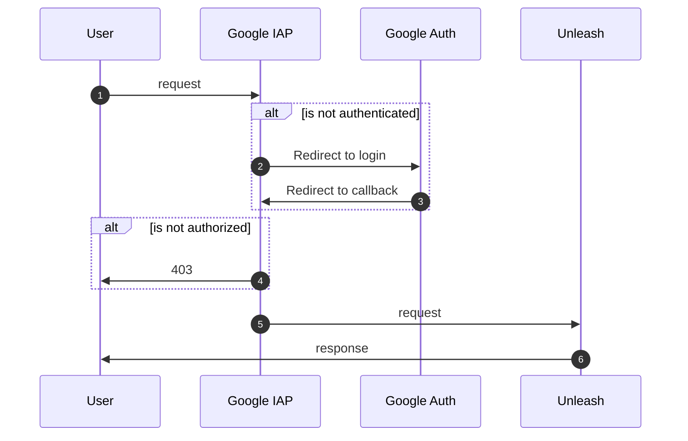

# NAV Unleash


Simple [Unleash v4 server][unleash] with [Google IAP authentication][google-iap]. Built to work well with [Unleasherator][unleasherator] our Kubernetes operator for managing Unleash instances.

[unleash]: https://github.com/Unleash/unleash
[unleasherator]: https://github.com/nais/unleasherator
[google-iap]: https://cloud.google.com/iap/docs/



## Configuration

| Environment variable | Description | Default |
|----------------------|-------------|---------|
| `GOOGLE_IAP_JWT_HEADER` | Header name for JWT token from Google IAP | `x-goog-iap-jwt-assertion` |
| `GOOGLE_IAP_JWT_ISSUER` | Issuer for JWT token from Google IAP | `https://cloud.google.com/iap` |
| `GOOGLE_IAP_JWT_AUDIENCE` | Audience for JWT token from Google IAP | **REQUIRED** |
| `IAP_PUBLIC_KEY_CACHE_TIME` | Cache time for JWT token public keys from Google IAP | `3600` |

### IAP JWT Audience

`GOOGLE_IAP_JWT_AUDIENCE` should be a string in the following format:

```text
/projects/PROJECT_NUMBER/global/backendServices/SERVICE_ID
```

## Setup for local development

### Prerequisites

- [Node.js][nodejs] 16 or later
- [Docker][docker]

[nodejs]: https://nodejs.org/en/
[docker]: https://www.docker.com/

### Running Unleash

The simplest way to run Unleash is to use `docker-compose`:

```bash
docker-compose up --build
```

This will start a local Postgres database in a Docker container and expose Unleash on `http://localhost:8080`.

To build the code, run `yarn build`. This will compile the TypeScript files to ES2017 and place them in `./dist/`. Unleash can then be run with `yarn start`. For convenience you can also use the `yarn build-and-start` command.

Running Unleash locally requires a database. The easiest way to get one is to use Docker:

```bash
docker-compose up -d postgres
```

This will start a local Postgres database in a Docker container. You can then connect to it using the following credentials:

```bash
export DATABASE_USERNAME=unleash
export DATABASE_PASSWORD=unleash
export DATABASE_NAME=unleash
export DATABASE_HOST=localhost
export DATABASE_SSL=false
```

You also need the following environment variables:

```bash
export INIT_ADMIN_API_TOKENS=*:*.unleash4all
export GOOGLE_IAP_AUDIENCE=/projects/123/global/backendServices/123
```

## Contact

Requests and questions can be made via issues on the repo. For NAV employees this can be done easiest via the slack channel [#unleash][nav-slack-unleash].

[nav-slack-unleash]: https://nav-it.slack.com/archives/C9BPTSULS

## License

[MIT](LICENSE)
