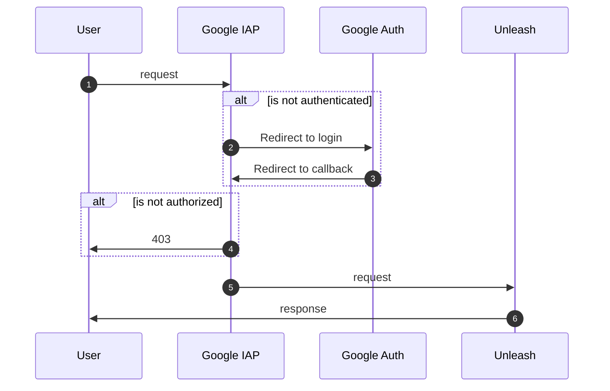

# NAV Unleash


En enkel [Unleash v4 server][unleash] med Google IAP
autentisering. Denne er bygget for å fungere godt sammen med [Unleasherator][unleasherator] vår Kubernetes operator for å håndtere Unleash instanser.

[unleash]: https://github.com/Unleash/unleash
[unleasherator]: https://github.com/nais/unleasherator
[google-iap]: https://cloud.google.com/iap/docs/



## Konfigurasjon

| Environment variable | Description | Default |
|----------------------|-------------|---------|
| `GOOGLE_IAP_JWT_HEADER` | Header name for JWT token from Google IAP | `x-goog-iap-jwt-assertion` |
| `GOOGLE_IAP_JWT_ISSUER` | Issuer for JWT token from Google IAP | `https://cloud.google.com/iap` |
| `GOOGLE_IAP_JWT_AUDIENCE` | Audience for JWT token from Google IAP | **REQUIRED** |

### IAP JWT Audience

`GOOGLE_IAP_JWT_AUDIENCE` skal være en string på følgende format:

```text
/projects/PROJECT_NUMBER/global/backendServices/SERVICE_ID
```

## Oppsett for utvikling lokalt

For å teste kjøre opp en test-instans lokalt kan man bruke `docker-compose up --build`.
Denne vil sette opp en lokal postgres database i en docker-container og
eksponere unleash på url `http://localhost:8080`.

For å bygge koden kjører du `yarn build`. Dette vil kompilere typescript-filene til ES2017
som legges i `./dist/`. Unleash kan da kjøres med `yarn start`.

## Henvendelser

Henvendelser og spørsmål kan gjøres via issues på repoet. For direkte kontakt kan man også høre med Tjenesteplattform (NADA og NAIS). For NAV-ansatte kan dette enklest gjøres via slack-kanalen #unleash. Der vil man også kunne komme i kontakt med enkelte av utviklerne av Unleash (upstream).
For eksterne er det mulig å sende mail til Audun F. Strand (audun.fauchald.strand@nav.no).
